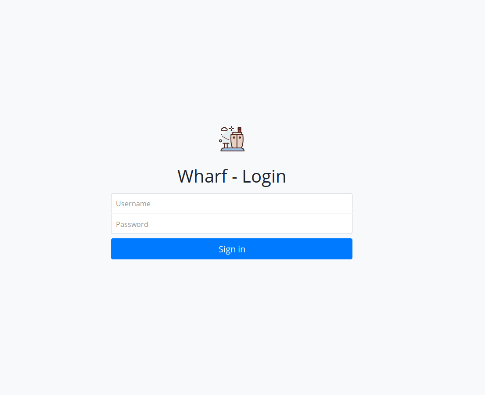
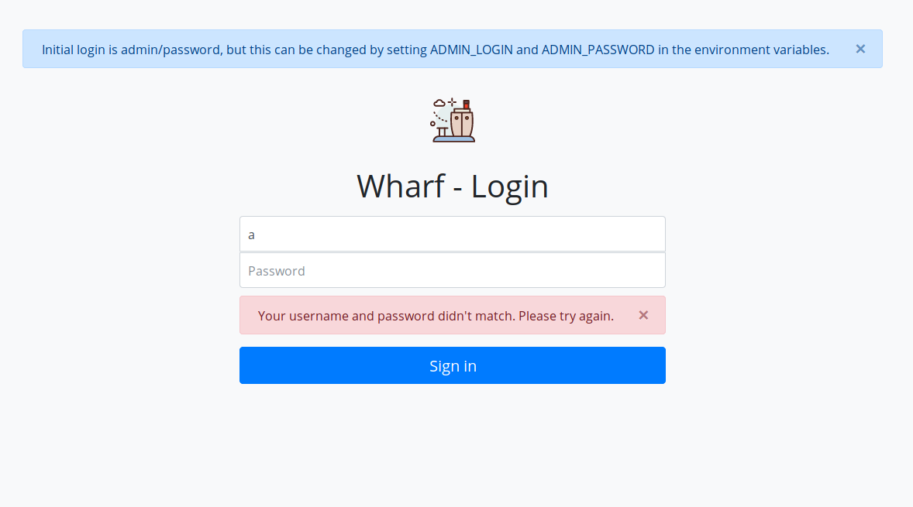

# Summary of changes

## v0.1.0

A new login screen was added, with a new template and static assets structure. All templates now must have their on
`<body></body>` tags and their respective styling sheets and javascript files. 

This is far away from a ideal and optimized structure, but this is the first part of a "componentization" of templates.

- New Login screen template added:
  - Old login screen:
    
  - New login screen:
    
  - New login screen with alerts:
    