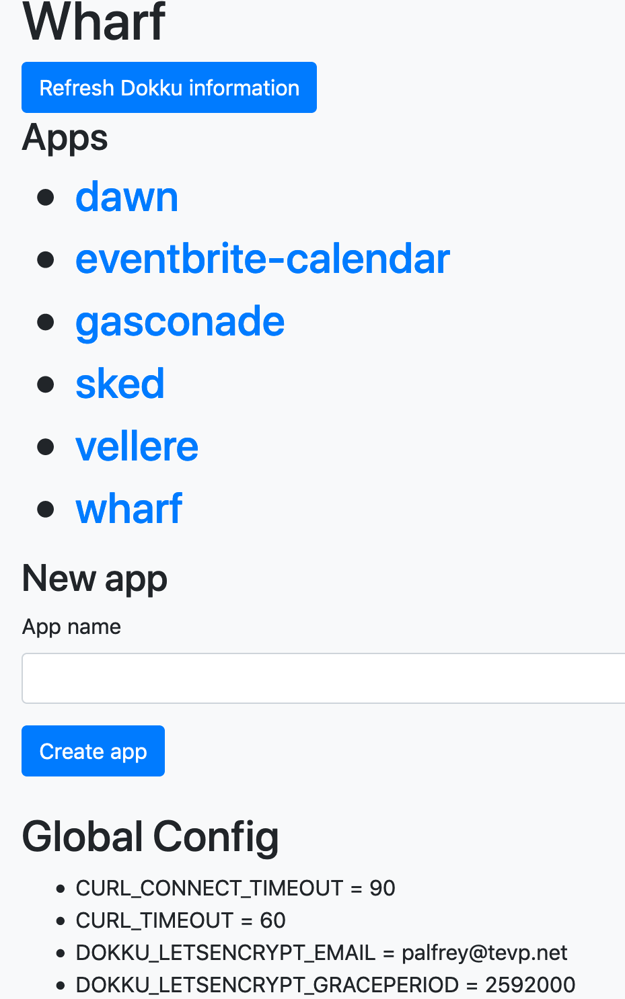
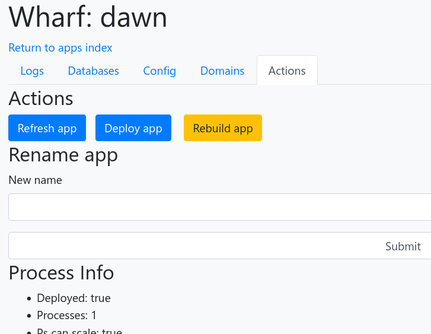

Wharf
=====

Wharf is an opinionated web frontend for [Dokku](https://dokku.com/docs/). You can also use the command line version, but most features you'll need day-to-day are in the Web UI

Screenshots
-----------
 

Setup
-----
1. [Install Dokku](https://dokku.com/docs/getting-started/installation)
2. Install the following plugins:
  * https://github.com/dokku/dokku-redis
  * https://github.com/dokku/dokku-postgres
  * https://github.com/dokku/dokku-letsencrypt
3. Setup the Let's Encrypt plugin to auto-renew (`dokku letsencrypt:cron-job --add`)
4. Create the app (`dokku apps:create wharf`)
5. Let Wharf talk to Dokku either by:
    * Add SSH key storage:
        1. `mkdir /var/lib/dokku/data/storage/wharf-ssh/`
        2. `chown dokku:dokku /var/lib/dokku/data/storage/wharf-ssh/`
        3. `dokku storage:mount wharf /var/lib/dokku/data/storage/wharf-ssh/:/root/.ssh`
    * Or add dokku-daemon
        1. Install as per instructions at https://github.com/dokku/dokku-daemon
        2. `dokku storage:mount wharf /var/run/dokku-daemon/dokku-daemon.sock:/var/run/dokku-daemon/dokku-daemon.sock`
6. Add Redis (`dokku redis:create wharf && dokku redis:link wharf wharf`)
7. Add Postgres (`dokku postgres:create wharf && dokku postgres:link wharf wharf`)
8. Set `ADMIN_PASSWORD` to something secret (`dokku config:set wharf ADMIN_PASSWORD=somesecret`)
9. Deploy this Git repo [as per the standard Dokku instructions](https://dokku.com/docs/deployment/application-deployment/)
10. `dokku ps:scale wharf celery=1`

Helpful hints
-------------
* If you're running SSH on a non-standard port, set `DOKKU_SSH_PORT` e.g. `dokku config:set wharf DOKKU_SSH_PORT=2222`
* If Dokku is running somewhere else than the local machine, set `DOKKU_SSH_HOST` e.g. `dokku config:set wharf DOKKU_SSH_HOST=foo.example.com`
* If there's a Dockerfile in your repository, it'll [try and deploy using that by default](https://dokku.com/docs/deployment/methods/dockerfiles/). Set BUILDPACK_URL to override
* BUILDPACK_URL should be an HTTPS one, not a SSH or heroku/something one
* You should setup the global domain name when creating Dokku to start with and add a *.&lt;your dokku domain&gt; entry to give new apps more usable names.
* Set `GIT_BRANCH` in the variables to deploy from non-master

Enabling Github auto-deploy webhooks
------------------------------------
1. Set `GITHUB_SECRET` config item to something secret
2. Goto [settings/webhooks](https://developer.github.com/webhooks/creating/#setting-up-a-webhook) in Github
3. Make a new webhook for &lt;your Wharf instance&gt;/webhook with Content type as `application/json` and Secret to the secret from `GITHUB_SECRET`

Development
-----------
Easiest way to do dev is:

1. `vagrant up` which will boot the entire Dokku setup in a VM
2. `DOKKU_SSH_HOST=host.docker.internal DOKKU_SSH_PORT=2222 docker-compose up`
    * `host.docker.internal` works on Mac/Windows, but not on Linux (see https://github.com/docker/for-linux/issues/264). On Linux hosts, you should set `DOKKU_SSH_HOST` to whatever your IP is (not localhost, but a local IP is fine)
3. Load up `http://localhost:8000/`
