#Wharf - A web UI for Dokku

1. [About this fork](#about-this-fork)
2. [Pre requisites](#pre-requisites)
3. [Setup](#setup)
4. [Helpful hints](#helpful-hints)
5. [Enabling Github auto-deploy webhooks](#enabling-github-auto-deploy-webhooks)
6. [Development setup](#development-setup)
7. [Roadmap](#roadmap)
8. [Screenshots](#screenshots)

This is a forked version of Wharf. Check out the original project to more details.

Wharf is an web frontend for [Dokku](http://dokku.viewdocs.io/dokku/). 

Dokku it is a great Heroku-like tool, with a extensive command line operation. This web interface aims to 
simplify some routine tasks when managing applications on Dokku.

## About this fork

The original Wharf project has the functional backend needed. But the front-end was not usable at the time. So, this project
idea is to bring a modern and simple as possible front end interface to Wharfs functions.

But with the development of frontend screens, some backend adjustments was necessary, making this project merely impossible to merge with original project without sacrificing much of it.

Also the tests for the original project are not approved, because of my lack of knowledge about Python and Django, leading the original project to a inefficient state. 

## Pre requisites

1. [Install Dokku](http://dokku.viewdocs.io/dokku/getting-started/installation) on your server.

2. Install the following plugins:
  * https://github.com/dokku/dokku-redis
  * https://github.com/dokku/dokku-postgres
  * https://github.com/dokku/dokku-letsencrypt
  * https://github.com/dokku/dokku-mariadb
  
3. [A Google API & Services OAuth Credentials to login in.](https://console.developers.google.com/apis/credentials), with API Key and OAuth 2.0 Client IDs setup.

## Setup

1. Setup the Let's Encrypt plugin to auto-renew: (`dokku letsencrypt:cron-job --add`)
2. Create a new app: (`dokku apps:create wharf`)
3. Add SSH key storage:
  * `mkdir /var/lib/dokku/data/storage/wharf-ssh/`
  * `chown dokku:dokku /var/lib/dokku/data/storage/wharf-ssh/`
  * `dokku storage:mount wharf /var/lib/dokku/data/storage/wharf-ssh/:/root/.ssh`
4. Add a Redis link (`dokku redis:create wharf && dokku redis:link wharf wharf`)
5. Add Postgres link (`dokku postgres:create wharf && dokku postgres:link wharf wharf`)
6. Set `ADMIN_PASSWORD` to something secret (`dokku config:set wharf ADMIN_PASSWORD=somesecret`)
7. Deploy this Git repo [as per the standard Dokku instructions](http://dokku.viewdocs.io/dokku/deployment/application-deployment/)

## Helpful hints

* If there's a Dockerfile in your repository, it'll [try and deploy using that by default](http://dokku.viewdocs.io/dokku/deployment/methods/dockerfiles/).
 Set BUILDPACK_URL to override this behaviour.
* BUILDPACK_URL should be an HTTPS one, not a SSH or heroku/something one
* You should setup the global domain name when creating Dokku to start with and add a *.&lt;your dokku domain&gt; entry to give new apps more usable names.

## Enabling Github auto-deploy webhooks

Github functions and deploys are disabled (at least not accessible) in this fork. 

## Development setup

Setup a dokku machine with Vagrant and a Wharf development environment with Docker and Docker Compose.

1. `vagrant up` which will boot the entire Dokku setup in a VM

2. Create a .env file (just copy .env.example to .env) and add the needed variables values from your setup:
    * DATABASE_URL
    * BROKER_URL
    * CACHE_URL
    * DOKKU_SSH_HOST
    * DOKKU_SSH_PORT
    * GITHUB_SECRET
    * ADMIN_PASSWORD
    * SOCIAL_AUTH_GOOGLE_OAUTH2_KEY
    * SOCIAL_AUTH_GOOGLE_OAUTH2_SECRET
    * SECRET_KEY

3. Run `docker-compose up --d` to start project services up.
    * Recommended running `docker-compose up --d --build --force-recreate`. This will generate new SSH key and invalidate any configuration or data.
    * `host.docker.internal` works on Mac/Windows, but not on Linux (see https://github.com/docker/for-linux/issues/264). 
    * On Linux hosts, you should set `DOKKU_SSH_HOST` to whatever your IP is (not localhost, but a local IP is fine)
    
4. Load up `http://localhost:8000/`

## Roadmap

* A access level control to logged in accounts;

* The application configuration misses some Dokku features:
  * exposing ports on application links;
  * rebuilding application;

* Add a Slack integration to notify about tasks results;

* Fixing many frontend bugs;

* Optimizing cache usage;

* Creating a settings page to hold users configuration;

## Screenshots

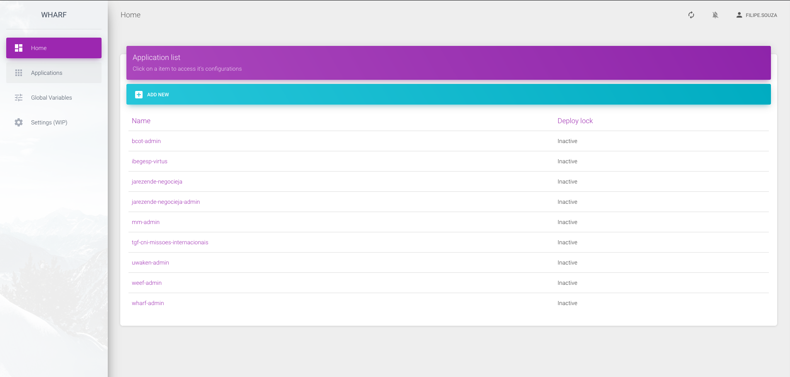

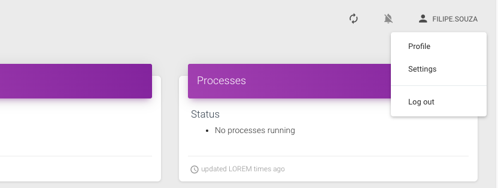

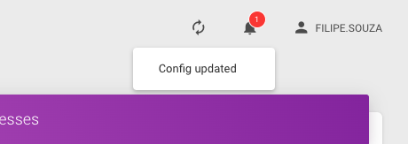

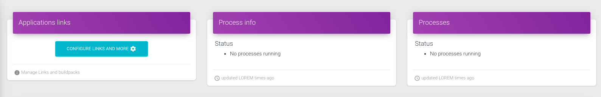

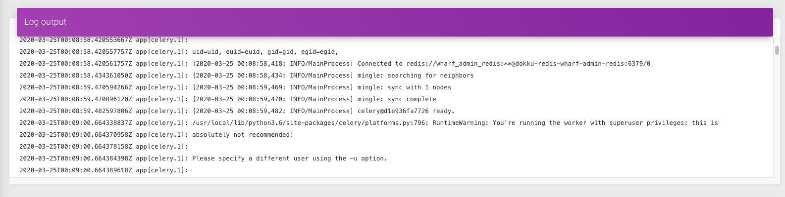

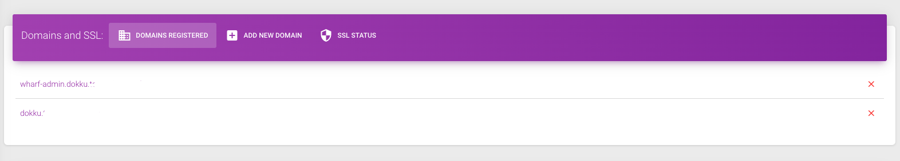

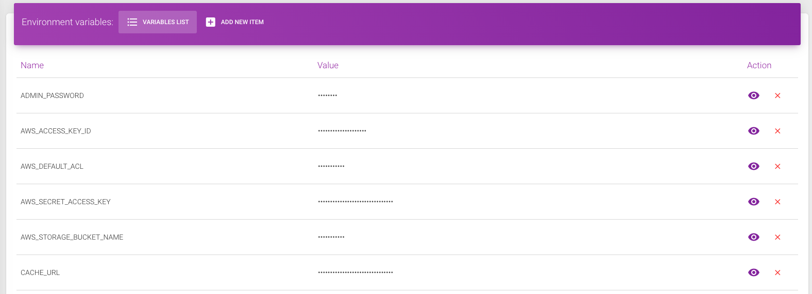

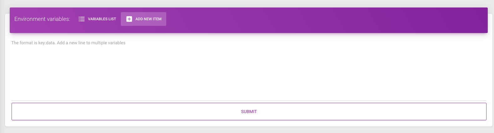

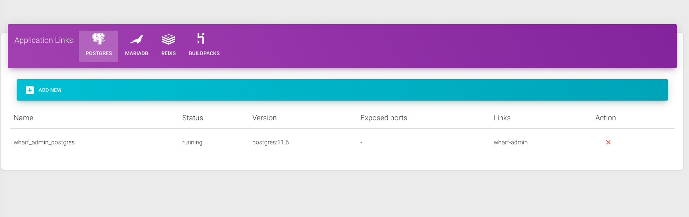

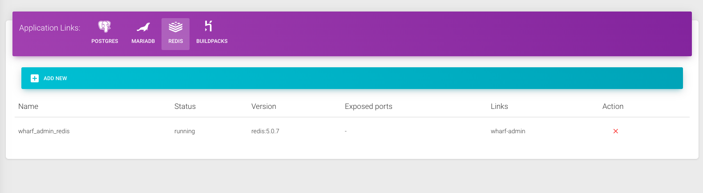

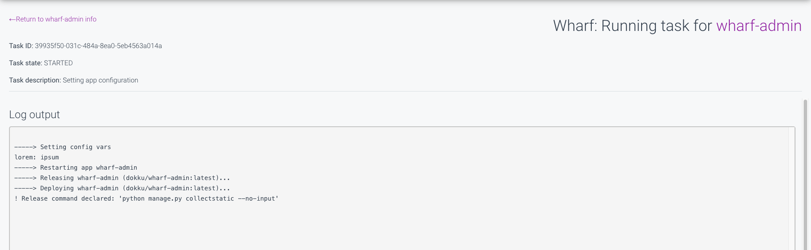